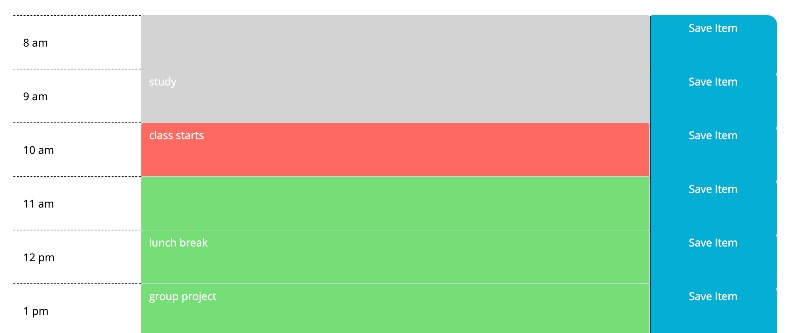

# day-planner
Day Planner

#### Jump to: 
* [Description](#description)
* [Link](#link)
* [Methods](#methods)
* [Author](#author)


## Description

Use this interactive day scheduling app to plan your workday! Keep track of the current time, save your to-do tasks (even after you refresh the page), and clearly see which time slots are past, present and future. 

<br><br>



<br><br>


## Link

[Interactive Day Planner](https://laurendarrimon.github.io/day-planner/)


## Built With

* [Javascript](https://www.w3schools.com/js/)
* [HTML](https://www.w3schools.com/html/default.asp)
* [CSS](https://www.w3schools.com/w3css/defaulT.asp)


## Methods 

### Bootstrap

Using Bootstrap for the layout, this planner has clear time slots for each part of the working day. 

### Moment.js

This planner app utilizes the moment.js library to generate the time. It displays the current time at the top of the page, as well as tracking the current hours. The hour slots that have passed are colored grey, the present hour is red, and the hours in the future are green. 

### Javascript

A Javascript function with an interval is used to track the current time, and style the sections according to if they are in the past, present, or future. For example, in the following code snippet, we are comparing the current hour, derived from moment.js to the index position of the array (shifted by 8, to make the index position match the hour)

```
function pastPresentFuture(){

    setInterval(function(){

    let currentHour = moment().format("k");

       for (i=0; i<$timeSlotTextArray.length; i++){

            //hour of the day)  
            if ( i + 8 < currentHour){
                $timeSlotTextArray[i].addClass("past");
            } else if ( i + 8 === currentHour ){
                $timeSlotTextArray[i].addClass("present");
            } else{ 
                $timeSlotTextArray[i].addClass("future");
            }
        }
    }, 1000)
}
```

In addition, to-do list items that the user inputs for each time slot text area are saved in local storage when the user  clicks the adjacent blue save button. The todo list items will automatcially display upon page load. 


## Author

### Lauren Duker Darrimon 

- [Link to Portfolio Site](https://www.laurenlalita.com)
- [Link to Github](https://github.com/LaurenDarrimon)
- [Link to LinkedIn](https://www.linkedin.com/in/lauren-lalita-duker-9537b1201/)